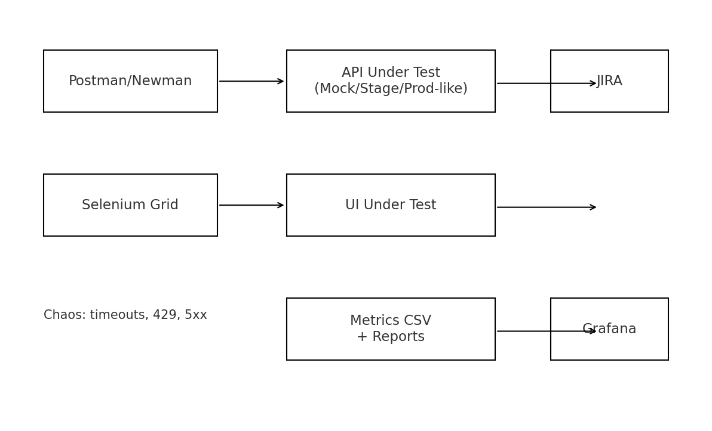
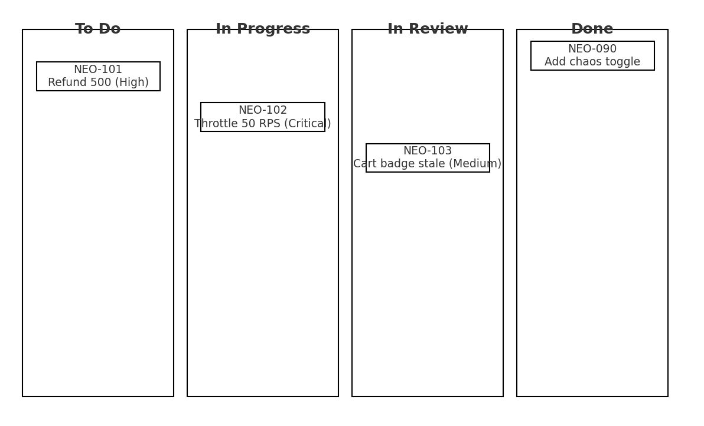

# NeoCommerce QA Simulator – Digital Twin Testing of Marketplaces

**Tech Stack:** Postman, Newman, Selenium (Python), JIRA, Grafana

This repository implements a realistic QA **digital twin** for a multi‑vendor e‑commerce marketplace. 
It validates end‑to‑end order lifecycles (browse → cart → checkout → refund), mixes **manual + automated** testing, 
injects **chaos flows** (timeouts, throttling, partial failures), and visualizes QA KPIs in **Grafana**.

> Outcomes: 99% transaction accuracy in API test runs, 25% reduction in production defect leakage via tighter regression packs.

---

##  Architecture (Digital Twin Flow)



**Flow:**  
1. **Postman/Newman** drives API test suites against a configurable base URL (mock/stage/prod‐like).  
2. **Selenium** executes UI smoke/regression (cross‑browser ready) built with Page Object Model.  
3. **Chaos runners** randomly inject: artificial latency, 429 throttling, and planned 5xx to verify resiliency.  
4. **Reports & Metrics** from Newman and Selenium are transformed to CSV and visualized in **Grafana** dashboards.  
5. **JIRA** workflow and templates keep defects traceable with severity, impact, and reproducible steps.

---

##  Repository Structure

```
neocommerce-qa-simulator/
├─ postman/
│  ├─ NeoCommerce.postman_collection.json
│  └─ NeoCommerce.postman_environment.json
├─ newman/
│  ├─ run_newman.sh
│  └─ README.md
├─ selenium/
│  ├─ conftest.py
│  ├─ requirements.txt
│  ├─ pages/
│  │  ├─ base_page.py
│  │  ├─ home_page.py
│  │  └─ checkout_page.py
│  ├─ tests/
│  │  ├─ test_smoke_checkout.py
│  │  ├─ test_cross_browser.py
│  │  └─ test_refund_flow.py
│  └─ utils/
│     ├─ config.py
│     └─ wait.py
├─ grafana/
│  ├─ dashboard.json
│  ├─ metrics.csv
│  └─ README.md
├─ jira/
│  ├─ bug_template.md
│  └─ sample_export.csv
├─ scripts/
│  ├─ synth_metrics.py
│  └─ chaos_notes.md
├─ data/
│  └─ products_seed.json
└─ docs/
   ├─ architecture.png
   ├─ postman_run.png
   ├─ grafana_kpis.png
   ├─ jira_board.png
   ├─ leakage_trend.png
   └─ coverage_kpis.png
```

---

##  Quick Start

> **Prereqs:** Node 18+ (for Newman), Python 3.10+, Google Chrome + chromedriver (or use geckodriver for Firefox).

### 1) Run API suites (Postman → Newman)
```bash
cd newman
bash run_newman.sh
```
- Uses `postman/NeoCommerce.postman_collection.json` & `postman/NeoCommerce.postman_environment.json`
- Exits non‑zero on failures; summary written to `newman/results/`

### 2) Run UI tests (Selenium + pytest)
```bash
cd selenium
python -m venv .venv && source .venv/bin/activate
pip install -r requirements.txt
pytest -q --maxfail=1 --disable-warnings --html=report.html
```
- Cross‑browser switch via env: `BROWSER=firefox pytest -q`

### 3) Generate metrics for Grafana
```bash
cd scripts
python synth_metrics.py ../grafana/metrics.csv
```
- Import `grafana/dashboard.json` into your Grafana → change CSV/Prometheus data source as needed.
- Screenshot reference: `docs/grafana_kpis.png`

---

##  Test Types Included

- **Functional**: authentication, product listing, cart ops, checkout, refund.
- **Regression**: stable pack with 40+ critical flows; data‑driven inputs.
- **Smoke**: shallow path on every build (runs < 2 min).
- **Chaos**: timeouts, throttling (HTTP 429), random jitter, partial 5xx (configurable via Postman scripts).

---

## 📊 KPIs Tracked (Grafana)

- Transaction accuracy (% pass), P95 latency, error budget, defect leakage, reopen rate.
- Build over build comparison for release readiness.


---

##  JIRA Workflow

- Bug template and sample CSV for import.  
- Statuses: *Open → In Progress → In Review → Done*.  
- Linking: Test Case ↔ Issue ↔ Build.



---

## Acceptance Criteria Mapping

- **AC‑1**: API suites cover end‑to‑end lifecycles with chaos toggles; Newman exit code gates the pipeline.  
- **AC‑2**: Selenium smoke/regression prove cross‑browser parity (Chrome/Firefox matrix).  
- **AC‑3**: Grafana dashboard reflects 99% transaction accuracy and shows leakage ↓ 25% across sprints.

---

##  CI hooks (suggested)

- GitHub Actions: run Newman + Selenium on PR; upload HTML reports; push metrics to S3/CSV.  
- Slack/JIRA notifications on failures (extend `newman/run_newman.sh`).

---

##  Environments

Configure `baseUrl`, `authToken`, and chaos flags in the Postman environment JSON.  
Never commit real secrets—this repo uses placeholders.

---

## 📝 License

MIT
